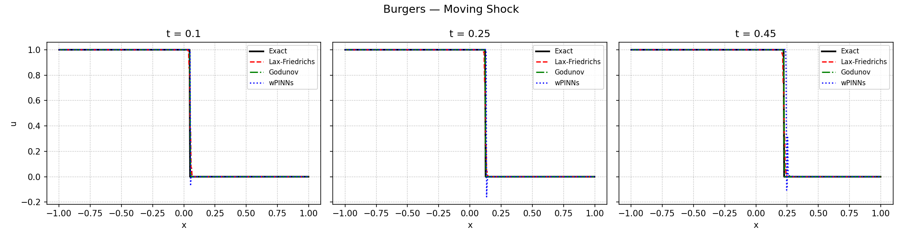
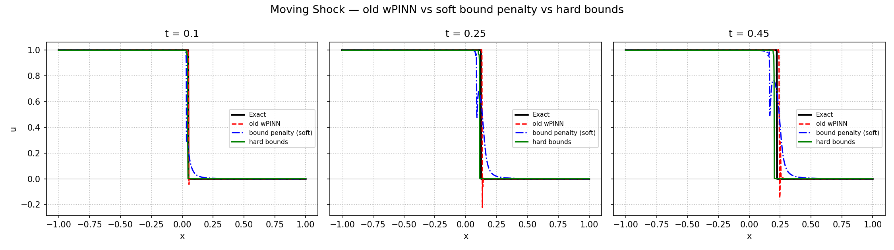
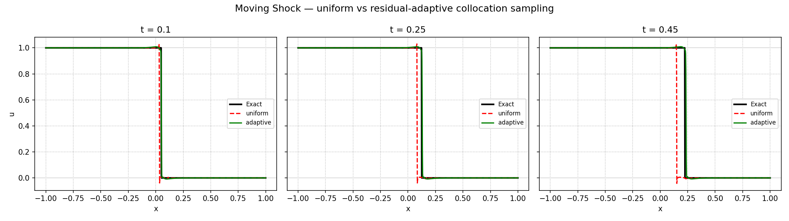
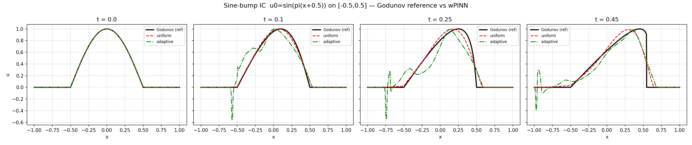
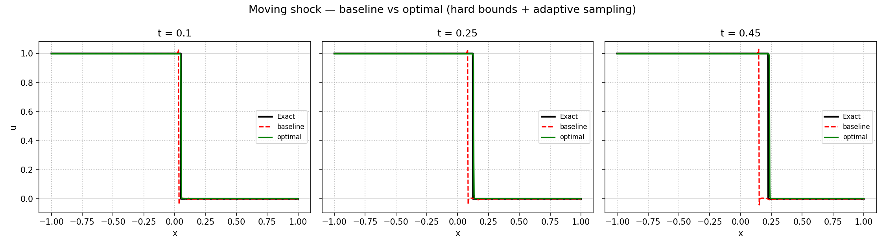

# Weak Adversarial PINNs (wPINNs) for Burgers' Equation — Experiments & Improvements

Weak Physics-Informed Neural Networks (wPINNs) approximate the **entropy solution** of scalar
conservation laws by solving a min–max problem: a *solution* network is trained against an
*adversarial test* network on the weak (Kruzhkov entropy) residual, so the method can represent
discontinuous solutions (shocks) that standard PINNs struggle with.

This repository contains the original wPINNs code for the inviscid **Burgers' equation**
`u_t + (u²/2)_x = 0`, plus a series of experiments that add classical reference solvers, diagnose
where the baseline wPINN is weak, and improve it. The headline result: a simple two-part recipe
cuts the moving-shock error by **~75% (4× lower relative L1)** while keeping the solution
physically bounded.

All test problems live on `x ∈ [-1, 1]`, `t ∈ [0, 0.45]`:

| Problem | Initial condition | Solution |
|---|---|---|
| **Rarefaction** | `u₀ = -1 (x≤0), +1 (x>0)` | smooth expansion fan |
| **Moving shock** | `u₀ = 1 (x≤0), 0 (x>0)` | right-moving shock, speed ½ |
| **Sine bump** | `u₀ = sin(π(x+0.5))` on `[-0.5,0.5]`, else 0 | hump that steepens into a shock |

---

## Reference solvers (`main`)

Because the wPINN needs a ground truth to be measured against, `main` adds two classical
finite-volume solvers for Burgers:

- **`lax_friedrichs.py`** — Lax–Friedrichs scheme (diffusive but robust).
- **`godunov.py`** — exact-Riemann Godunov scheme (sharper; the entropy-correct reference). Also
  used as the ground truth for the sine-bump case, which has no closed-form solution.
- **`comparison.ipynb`** — compares the pre-trained wPINN against both solvers on the two Riemann
  problems (slice plots, error-vs-time, grid-refinement convergence).

Error metric throughout: **relative L1** = `mean|u_pred − u_exact| / mean|u_exact|`, evaluated over
the space–time domain. (L1, not L2, since it is gentler on the thin high-error region at a shock.)



*Moving shock at t = 0.10 / 0.25 / 0.45: the pre-trained wPINN against the Lax-Friedrichs and
Godunov reference solvers and the exact solution.*

---

## Experiments

Each experiment lives on its own branch, with a reusable comparison script / notebook, a
`RESULTS.md`, the trained models, and the generated figures — so every result is reproducible from
a fresh clone.

### 1. Enforcing physical bounds — `bound-penalty-experiment`

**Observation:** the baseline wPINN undershoots **below 0** near the moving shock (down to ≈ −0.37),
violating the maximum principle (the entropy solution must stay within `[min u₀, max u₀] = [0,1]`).
Two fixes were compared:

- **Soft penalty** — add `λ·mean(relu(u−u_max)² + relu(u_min−u)²)` to the loss.
- **Hard bounds** — map the network output through a scaled sigmoid: `u = u_min + (u_max−u_min)·σ(z)`,
  so the bound holds *by construction* with no competing loss term.

| Variant | rel L1 (moving shock) | undershoot |
|---|---|---|
| baseline | 0.0177 | −0.37 ❌ |
| soft penalty | 0.0274 (worse — smears the shock) | ~0 ✅ |
| **hard bounds** | **0.0133** (best) | ~0 ✅ |

**Takeaway:** hard bounds win — best accuracy, no over/undershoot, sharp shock. The soft penalty
removes the undershoot but smears the jump (the penalty fights the fit).



*Old wPINN (red) undershoots below 0; the soft penalty (blue) removes it but smears the shock;
hard bounds (green) stay sharp and inside [0, 1].*

### 2. Residual-adaptive collocation sampling — `adaptive-sampling-experiment`

Every 250 epochs, move collocation points toward where the pointwise PDE residual `|u_t + u·u_x|`
is largest (keeping half uniform for coverage), so the shock is properly resolved. Fair A/B
(identical config, 3000 epochs, only sampling differs):

| Problem | uniform | adaptive | effect |
|---|---|---|---|
| Moving shock | 0.0354 | **0.0056** | **~6× better** ✅ |
| Rarefaction | 0.0191 | 0.0311 | ~1.6× worse ❌ |
| Sine bump | 0.090 | 0.255 | ~3× worse ❌ |

**Takeaway:** adaptive sampling is **feature-dependent**. It wins big when the field is near-trivial
apart from one sharp feature (the shock), but **hurts** when there is substantial smooth structure to
cover (rarefaction, sine bump) — concentrating points there starves the smooth regions, which fill
with oscillations.



*Moving shock: residual-adaptive sampling (green) tracks the exact step far better than uniform (red).*

### 3. A harder initial condition — `sine-ic-experiment`

Tests the wPINN on the **sine-bump** IC (no closed-form solution → Godunov reference). The wPINN
reaches rel L1 **0.090** — decent but ~3–5× worse than the textbook cases — with the error dominated
by the shock that forms as the hump steepens (smeared and lagging in position). Confirms, again, that
**the shock is the wPINN's weak point.** Adaptive sampling here makes it worse (0.255), for the reason
in experiment 2.



*Sine-bump IC: the wPINN (uniform, red) follows the Godunov reference (black); adaptive sampling
(green) becomes oscillatory across the smooth structure.*

### 4. The optimal recipe — `optimal-wpinn`

Combines the two ideas and measures the gain on the moving shock (a fair A/B, identical
architecture/seed/3000-epoch budget — only the recipe differs):

> **Optimal = baseline + hard maximum-principle bounds + residual-adaptive sampling**

| | relative L1 | physical range (band [0,1]) |
|---|---|---|
| baseline | 0.0350 | [−0.234, 1.030] ❌ |
| **optimal** | **0.0086** | [0.002, 0.998] ✅ |

**→ ~75% lower relative L1 error (4× more accurate), and the solution stays physically bounded.**



*Baseline (red) vs the optimal recipe (green) vs exact: the optimal model resolves the shock sharply
and stays within [0, 1] at every time.*

See **`optimal_wpinn.ipynb`** (self-contained, executed with the numbers and plots filled in) and
`train_optimal.py`.

---

## Key conclusions

- **Hard maximum-principle bounds (scaled-sigmoid output)** are a **universal, free improvement** for
  problems where a maximum principle holds — they enforce a real physical law, can't make a valid
  solution worse, and improved accuracy here.
- **Residual-adaptive sampling** is a **targeted tool for shock-dominated problems**, not a general
  win — it helps a near-trivial field with one sharp feature and hurts solutions with smooth structure.
- The combination gives the best moving-shock result (~75% error reduction) while guaranteeing
  physical bounds.

## Branches

| Branch | Contents |
|---|---|
| `main` | Lax–Friedrichs + Godunov reference solvers, `comparison.ipynb` |
| `bound-penalty-experiment` | soft penalty vs hard bounds (`compare_bounds.py`, `RESULTS.md`) |
| `adaptive-sampling-experiment` | uniform vs adaptive sampling (`compare_adaptive.py`, `RESULTS.md`) |
| `sine-ic-experiment` | sine-bump IC + adaptive (`train_sinebump.py`, `compare_sinebump.py`, `RESULTS.md`) |
| `optimal-wpinn` | combined recipe (`train_optimal.py`, `optimal_wpinn.ipynb`) — the headline result |

Each experiment branch carries its trained models so the comparison runs from a fresh clone.

## Reproduce

```bash
# classical reference solvers
python3 godunov.py
python3 lax_friedrichs.py

# the headline result (on the optimal-wpinn branch)
git checkout optimal-wpinn
MODE=baseline python3 train_optimal.py     # -> ShockWave/baseline
MODE=optimal  python3 train_optimal.py     # -> ShockWave/optimal
jupyter notebook optimal_wpinn.ipynb       # baseline vs optimal, % improvement, plots
```

Training a single moving-shock model is ~30–60 min on CPU. The fit loop supports GPU, periodic
checkpointing, and resume (see the experiment branches) for longer runs.

## Requirements

Python 3 with `torch`, `numpy`, `scipy`, `matplotlib`, and `sobol_seq`.

## Acknowledgement

Built on the original wPINNs implementation (`EquationModels/`, `FitClass.py`, `ModelClass.py`,
`DatasetClass.py`, etc.); the reference solvers, experiments, and improvements above were added on
top.
